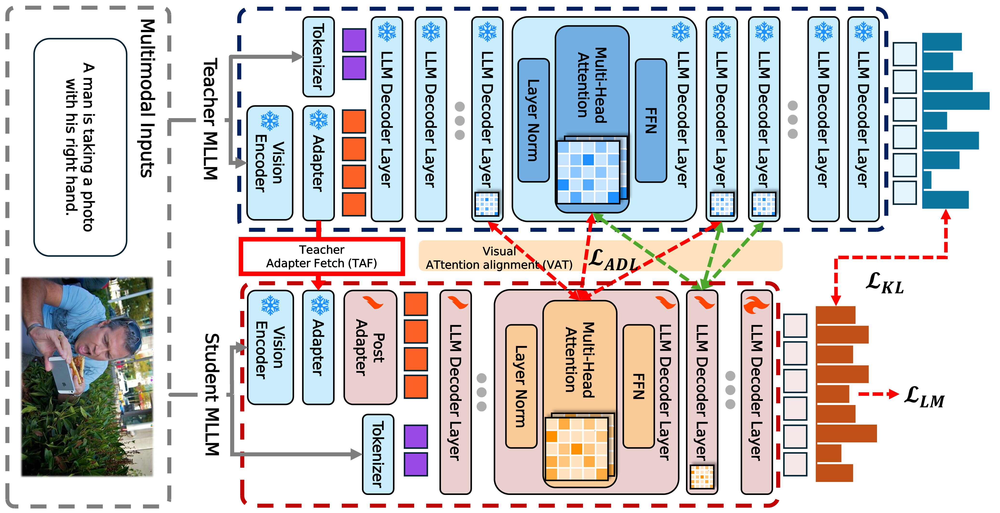

# CompoDistill: Attention Distillation for Compositional Reasoning in Multimodal LLMs

The official source code for **CompoDistill: Attention Distillation for Compositional Reasoning in Multimodal LLMs** paper

## Overview

Recently, efficient Multimodal Large Language Models (MLLMs) have gained significant attention as a solution to their high computational complexity, making them more practical for real-world applications. In this regard, the knowledge distillation (KD) approach has emerged as a promising alternative, which transfers the rich visual and linguistic knowledge from a larger model (teacher) to a smaller model (student). However, we observe that existing KD methods struggle to effectively distill the teacher MLLM's rich visual perception abilities to the student, a challenge that has been largely overlooked in previous studies. Through a systematic analysis, we identify visual attention misalignment between student and teacher as the main cause of this issue. Based on this insight, we propose CompoDistill, a novel KD framework that explicitly aligns the student's visual attention with that of the teacher to enhance the student's visual perception abilities. Our extensive experiments show that CompoDistill significantly improves performance on compositional reasoning tasks that require visual perception abilities while maintaining strong performance on visual question answering tasks, as done in existing studies. Furthermore, CompoDistill demonstrates effectiveness with a more advanced backbone, highlighting its generalizability.

  

## Environment
    conda create -n [env name] python=3.13
    conda activate [env name]
    pip install -r requirements.txt

## Data Construction
We use LLaVA Pre-Training dataset in DPT stage and LLaVA Fine-Tuning dataset in DFT and SFT stage. 

## Training
    bash scripts/train/lora/distill_dpt.sh # Distilled Pre-Training (DPT)
    bash scripts/train/lora/distill_dft.sh # Distilled Fine-Tuning (DFT)
    bash scripts/train/lora/distill_sft.sh # Supervised Fine-Tuning (SFT)